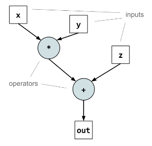

众核数据流架构
================

在深入探讨众核数据流架构之前，我们先回顾一下当前占据统治地位的两种计算架构——CPU与GPU，这将有助于我们理解数据流架构诞生的背景与独特价值。

*   **CPU (Central Processing Unit)**：作为通用计算的基石，CPU 遵循经典的 **冯·诺依曼架构**。其核心设计目标是处理极其复杂的控制逻辑（分支预测、乱序执行等）。
    
    - **复杂的内存设计与控制单元**：CPU 的晶体管预算大量投入到了巨大的缓存（Cache）和复杂的控制单元上。它的设计目标是尽快完成一个串行任务。因此，它拥有强大的分支预测能力来减少跳转等待，以及乱序执行来填补流水线空闲。
    - **计算单元占比低**：相比于控制逻辑和缓存，真正的算术逻辑单元（ALU）在 CPU 芯片面积中的占比其实很小。
    - **共享内存与缓存一致性**：为了简化多核编程，CPU 在硬件层面实现了复杂的 **缓存一致性协议 (如 MESI)**。这意味着所有核心看到的内存视图必须时刻保持一致。这种“强中心化”的设计虽然方便了软件开发，但在核心数量增加时，维护一致性的广播与同步开销会急剧上升，限制了大规模并行扩展能力。
    - **控制流模式**：程序计数器（PC）指引 CPU 逐条读取指令，指令再指挥数据进行移动和计算。这种模式虽然赋予了 CPU 处理复杂计算任务的强大能力，但在面对海量重复的计算任务时，其复杂的控制逻辑反而成为了负担。

*   **GPU (Graphics Processing Unit)**：为了解决图形渲染中大规模并行计算的需求，GPU 应运而生。
    
    - **大规模计算核心**：GPU 将晶体管预算主要投入到了海量的计算核心（ALU）上，以此换取极致的并行吞吐量。它大大简化了控制逻辑和缓存层级。
    - **SIMT (单指令多线程)**：GPU 采用 SIMT 模型，一个指令流同时控制成千上万个线程。这种方式非常适合处理图形像素或矩阵运算这种整齐规律的任务。同时，GPU 靠切换线程来降低延迟。当一组线程在等待内存数据时，GPU 会迅速切换到另一组就绪的线程继续计算，从而保持流水线繁忙。
    - **中心化的控制模式**：虽然 GPU 拥有海量核心，但它们通常通过共享的 L2 缓存或全局显存（Global Memory）交换数据。更重要的是，GPU 的执行高度依赖 Host CPU 的指令调度。这种中心化的存储与控制模式，在面对极大规模分布式计算时，依然存在同步与通信的瓶颈。
    - **局限性**：尽管并行度极高，GPU 本质上仍未脱离 **“指令驱动”** 的范式。数据必须等待指令下达后才能被处理，且数据在内存层级间的移动仍受指令控制。Host CPU 仍需不断通过总线向 GPU 发送指令，这引入了额外的开销。

然而，随着 AI 模型参数量与计算量的指数级增长，这种“指令控制数据”的模式日益显现出瓶颈：指令解码的开销、线程同步的等待、以及最致命的“内存墙”问题。

正是在这种背景下，**数据流架构 (Dataflow Architecture)** 作为一种“回归计算本质”的范式成为了新的选择。它不再由指令流控制执行顺序，而是 **由数据的可用性直接驱动计算**。这种范式与传统冯·诺依曼架构截然不同，为解决大规模 AI 计算难题提供了全新的思路。

数据驱动的执行模式
--------------------

计算操作（如数据流图中的节点）的执行，不是由传统的程序计数器（PC）按顺序取指令决定，而是由其所有依赖的输入数据是否准备好来决定。这与GPU的“控制流”模式截然不同。GPU依赖于CPU发来的指令流，按顺序启动一个个计算核（Kernel），即使数据早已在显存中准备就绪，也必须等待指令到达才能执行。数据流架构则消除了这种“指令等待数据”的延迟，计算单元在数据到达的那一刻就可以立即开始工作，实现了真正的“数据驱动计算”。

图算结合
--------------------------------

数据流架构具有良好的图适应性，程序被编译成一个数据流图（Dataflow Graph），节点是算子（Operator），边代表数据依赖和流动方向。
这是数据流架构的灵魂所在，编译器精确地知道A计算单元何时完成计算，以及B计算单元何时需要这个结果。因此，它可以生成指令，让数据在精确的时间点，通过NoC从A直接发送到B。
也就是说我们可以通过在软件编译层面的设计，来减少硬件通信方面的开销。相较于GPU的图算分离，数据流架构与传统的图计算框架（如TensorFlow、PyTorch）具备较好的相性。

上图以图形化方式展示了一个典型的数据流图：每个圆圈或方块代表一个算子节点，连线则表示前后算子之间的数据依赖和张量流向。编译器正是基于这样的图结构来规划哪些算子可以并行执行、哪些中间结果可以直接在片上转发，从而在硬件层面构建出与计算图高度一致的数据流执行路径。

编程范式对比实例：Kernel 模式 vs 图模式
~~~~~~~~~~~~~~~~~~~~~~~~~~~~~~~~~~~~~~~

为了更直观地理解这两种架构的差异，我们可以通过一个简单的“向量加法后乘法”（ :math:`D = (B + C) \times E` ）的计算任务，来对比它们在编程模型上的根本不同。

**1. GPU 的编程模型：以 Kernel 为中心的指令驱动**

在 GPU 开发（如 CUDA）中，开发者往往需要将计算任务拆解为一个个独立的 **Kernel（内核）**。每个 Kernel 完成一个简单的步骤，中间结果必须写回全局显存（Global Memory），下一个 Kernel 再从显存中读取。Host CPU 像一个指挥官，不断下达指令启动 Kernel。

.. code-block:: cpp
   :caption: GPU 编程模式

   // Kernel 1: 执行加法 A = B + C
   // 这里的 A, B, C 指向 GPU 的全局显存
   __global__ void add_kernel(float* A, float* B, float* C) {
       int i = threadIdx.x + blockIdx.x * blockDim.x;
       // [读取] 从全局显存读取 B 和 C 
       float b = B[i];
       float c = C[i];
       // [计算]
       float a = b + c;
       // [写入] 必须将中间结果 A 写回全局显存，否则下一个 Kernel 无法访问
       A[i] = a; 
   }

   // Kernel 2: 执行乘法 D = A * E
   __global__ void mul_kernel(float* D, float* A, float* E) {
       int i = threadIdx.x + blockIdx.x * blockDim.x;
       // [读取] 再次从全局显存读取 A (刚才写回去的数据) 和 E
       float a = A[i]; 
       float e = E[i];
       // [计算]
       float d = a * e;
       // [写入] 将最终结果 D 写回全局显存
       D[i] = d;
   }

   // Host (CPU) 代码：控制流
   void main() {
       // 1. CPU 发送指令启动加法 Kernel
       launch_kernel(add_kernel, ...);
       
       // 2.  CPU 等待 GPU 完成，确保数据 A 已安全写回显存
       cudaDeviceSynchronize();

       // 3. CPU 发送指令启动乘法 Kernel
       launch_kernel(mul_kernel, ...);
   }

**问题所在**：即使 `add_kernel` 和 `mul_kernel` 只是简单的操作，中间数据 `A` 也必须经历“写回显存 -> 读取显存”的过程。对于 GPU 而言，两个 Kernel 之间是隔离的，必须通过中心化的显存来传递状态，且需要 Host CPU 的介入来协调顺序。

**2. 数据流架构的编程模型：以图为中心的流式计算**

在数据流架构中，开发者关注的是 **定义计算图**。算子被映射到芯片上不同的计算单元，数据像流水线一样在单元之间直接流动，**中间结果不写回外部内存**。

.. code-block:: python
   :caption: 数据流编程模式

   def dataflow_program(B, C, E):
       # 定义计算图：节点与边
       # 编译器会将 add_node 映射到计算核心 Core_1
       A = Op.add(B, C) 
       
       # 编译器会将 mul_node 映射到邻近的计算核心 Core_2
       # 并配置片上网络，建立从 Core_1 到 Core_2 的直连通道
       D = Op.mul(A, E)
       
       return D

   # --- 执行阶段 ---
   # 1. 编译：整个图被一次性编译。编译器规划好：
   #    - Core_1 算完 A 后，直接通过 NoC 发送给 Core_2
   #    - Core_2 收到 A 后，立即触发计算 D
   compiled_graph = compile(dataflow_program)

   # 2. 运行：Host 只需发送一次“启动”信号，不需要干预中间过程
   #    数据在芯片内部自动流动，中间结果 A 永远不会离开片上 SRAM
   device.run(compiled_graph, inputs={B, C, E})

**优势**：这种模式下，`Op.add` 和 `Op.mul` 在空间上是并行的（Pipelined）。数据一生产出来就立即被消费，彻底消除了通过中心化显存交换数据的开销，也摆脱了 Host CPU 的频繁指令控制。

GPU的困境：内存墙
~~~~~~~~~~~~~~~~~~~~

而GPU的工作流程往往分为两个部分，CPU先构建并优化图，然后进行图的执行，它按照图中的依赖关系，依次遍历图的节点（算子）。
每当遇到一个算子，CPU就会向GPU下达一个指令：“启动执行器（CUDA Kernel），在XX内存地址上执行XX任务”。
GPU接到指令后，就调度其内部成千上万的计算核心（CUDA Cores）去执行这个Kernel。一个Kernel执行完毕后，通常会将结果写回到GPU的全局显存中。为此，GPU在数据传输上有大量开销，并且内存操作的速度远慢于计算操作的速度，这导致了GPU的计算能力无法得到充分利用，也就是常说的“内存墙问题”。
GPU缓解“内存墙”问题的思路通常是疯狂提升带宽，每一代GPU都在追求更高的内存带宽（HBM），从几百GB/s到如今的几个TB/s，但仍然面临着下面的问题：

- 算力增长远快于带宽增长：芯片上晶体管密度（以及由此带来的算力FLOPS）的增长速度，远远超过了芯片I/O接口（以及由此带来的带宽）的增长速度。
- 片外数据搬运存在大量能耗与延迟：将一个数据从DRAM搬到计算单元再写回去的能量开销，可能是执行一次计算本身的上百倍！即使拥有无限的带宽，可以让数据瞬间到达，每一次的访问也都在产生巨大的、不可避免的能量开销。对于需要海量数据吞吐的AI模型来说，这会导致芯片的功耗高得无法接受。
- 带宽再高也存在传递的延迟：GPU的“图算分离”模式，每次调用一个Kernel，都需要一次完整的“CPU -> GPU驱动 -> Kernel启动 -> 访问DRAM -> 写回DRAM”的流程。这个流程本身就存在固有的延迟。虽然GPU通过海量线程（Warp调度）的方式可以隐藏一部分延迟（当一部分线程在等数据时，另一部分线程可以先计算），但延迟本身并没有消失。

因此GPU的解决方法是一种“治标不治本”的策略，它能缓解问题，但无法从根本上解决问题。

数据流的“治本”之道
~~~~~~~~~~~~~~~~~~~~~~

而数据流架构，则是一种试图“治本”的全新思路。它不是去缓解内存墙，而是通过减少访存来试图绕开内存墙。

- 最大化的片上复用：通过编译器的全局规划，让数据尽可能地“定居”在芯片内部的SRAM中，被反复利用。这可以将访存的能耗降低百倍。
- 显式通信：让数据在片上计算单元之间直接“串门”（通过NoC），而不是每次都要先回显存报个到。这极大地降低了中间结果的读写延迟和能耗。

天然的并行性
----------------

由于执行仅依赖于数据，因此在数据流图中，任何两个没有直接数据依赖关系的节点，都可以在硬件资源允许的情况下同时执行。编译器可以轻易地从图中识别出所有潜在的并行机会，无论是算子内部的并行（如向量化），还是算子之间的并行（任务并行），都无需像GPU那样依赖复杂的运行时调度器去动态发掘。整个程序的并行性在编译阶段就可以被静态地、确定性地固定下来。

良好的可拓展性
--------------

数据流架构的计算和通信模式是局部化的。每个计算单元主要与其邻近的单元通信。这种特性使得架构可以通过增加更多的计算单元来线性地扩展整个系统的计算能力，而无需担心像传统多核CPU/GPU那样，因共享内存和缓存一致性协议带来的全局通信瓶颈。只要编译器能够将一个更大的计算图映射到更多的硬件单元上，性能就能随之增长，这也是为什么Cerebras能够制造出晶圆级芯片的底层逻辑。

众核数据流架构的局限性
----------------------

尽管数据流架构在AI计算领域展现出巨大的潜力，但其独特的特性也带来了一系列挑战，这也是其尚未取代传统GPU的原因。

1. **编译器负担的上升**
   数据流架构将复杂的运行时调度转移到了编译期。这虽然简化了硬件，却极大地增加了编译器的负担。编译器不仅需要理解计算图的结构，还需要精确掌握底层硬件的拓扑、SRAM容量以及通信延迟，以求解一个极度复杂的优化问题。当模型结构变得动态（如MoE路由）时，静态编译很难生成最优的执行计划，导致运行时效率大幅下降。

2. **通用性不足与缺乏良好的生态**
   GPU之所以成功，很大程度上归功于CUDA生态的通用性。数据流架构通常需要专用的软件栈（如Graphcore Poplar, SambaNova SambaFlow），这些软件栈虽然在特定AI负载上表现优异，但缺乏对通用计算（如复杂的控制流、非张量运算）的广泛支持。这使得迁移现有的、依赖大量自定义算子的业务代码变得异常困难。

3. **片上内存容量的限制与高张量并行的副作用**
   为了追求极致带宽，数据流架构往往依赖昂贵的片上SRAM。然而，SRAM的容量远低于DRAM。面对参数量动辄数千亿的LLM，单核内存远远无法容纳模型权重，导致了下面的结果。

   - **高张量并行（Tensor Parallelism）**：为了存下巨大模型，必须将权重矩阵切分到成千上万个核心上。这意味着每一次矩阵乘法运算，都被拆解成了数千个微小的计算任务。
   - **核间同步开销激增**：在Transformer架构中，每一层的计算结束都需要来汇总这些计算任务的和。当参与同步的核心数量激增到众核架构的数千个时，片上网络面临巨大的通信压力，通信延迟呈指数级上升。虽然计算被高度并行化了，但通信成为了新的串行瓶颈。大量的计算核心不得不频繁停下来等待邻居的数据，导致算力利用率大幅下降。

技术实现
--------
为了实现上述理想的设计理念，数据流面对着如下的问题：

编译器的优化能力
~~~~~~~~~~~~~~~~~~
数据流架构将大量的并行性与数据搬移控制交给软件，这要求编译器承担极具挑战性的工作：将高层计算图进行切分、将算子与数据合理映射到众多的处理单元上、规划通信路径与调度执行顺序。这比传统GPU的编译优化更为复杂。

解决方案示例
^^^^^^^^^^^^^^
- **SambaNova** 的可重构数据流单元（RDU）依赖其独家开发的编译器栈，为每个AI模型自动探索并生成最优的硬件配置与数据流图映射方案。
- **Graphcore** 的Poplar软件栈则要求编译器显式地将计算图划分到上千个处理器核（Tile）上，并管理每个核本地内存（SRAM）中的数据。

片上网络（NoC）的设计
~~~~~~~~~~~~~~~~~~~~~~~~
数据在处理单元之间的大量流动是数据流架构的常态。因此，片上网络必须提供极高的带宽与极低的延迟，以避免其成为性能瓶颈。网络拓扑、路由算法与流控机制的设计至关重要。

解决方案示例
^^^^^^^^^^^^^^
- **Cerebras** 将整个晶圆刻蚀成一颗芯片，其核心是连接了数十万个处理核心的2D网格网络，提供了惊人的片上带宽，数据抵达后直接触发计算。
- **Tenstorrent** 的 Wormhole 芯片设计了高性能的NoC，通过多个64位处理器核心进行路由，从而在多个芯片之间实现低延迟扩展。

对特定计算图的适应性
~~~~~~~~~~~~~~~~~~~~~~~~
静态的数据流硬件可能对某种特定结构（如规则的卷积网络）优化到极致，但在处理结构不规则、动态性强（如稀疏网络、Transformer）的模型时效率下降。

解决方案示例
^^^^^^^^^^^^^^
- **SambaNova RDU** 的“可重构”特性，使其能根据不同模型的计算图，动态调整芯片内部的数据通路，为每个模型定制专用的数据流路径。
- **Graphcore IPU** 采用MIMD（多指令多数据流）架构，每个核心都能执行不同的程序，相比GPU的SIMT架构，能更灵活地处理分支、稀疏计算等不规则任务。

缓存一致性
~~~~~~~~~~~~
传统多核CPU/GPU依赖复杂的硬件缓存一致性协议来维护统一的内存视图，但这在扩展到数千核心时会带来巨大的开销与瓶颈。数据流架构通常会选择绕开这个问题。

解决方案示例
^^^^^^^^^^^^^^
- **Graphcore IPU** 舍弃了硬件缓存一致性，每个核心只访问自己的本地SRAM。需要跨核通信时，由编译器在Poplar软件中进行显式的、可预测的数据同步与搬移，从而提升了能效与确定性。

保证可预测性与同步
~~~~~~~~~~~~~~~~~~~~~~
数据流架构的一个核心优势是通过编译期规划，将复杂的运行时调度与依赖判断转移至编译期完成，从而获得高度确定的性能。

解决方案示例
^^^^^^^^^^^^^^
- **Graphcore IPU** 采用块同步并行（Bulk Synchronous Parallel, BSP）模型，将程序执行划分为“本地计算”和“全局同步”两个阶段，使得并行执行的逻辑大大简化，性能可预测。
- **Google TPU** 也应用了数据流架构的思想，通过脉动阵列（Systolic Array）让数据在计算单元之间规律地流动和计算，执行效率极高且时序固定。

时代适应性
----------

工作负载变化
~~~~~~~~~~~~~~~~~~~~~~~~~~~~~~~~~~~~~~~~~~~~~
- **大语言模型（LLM）带来了参数量与序列长度的双重挑战**：LLM的推理过程是内存带宽密集型的。一方面，自回归生成涉及大量KV矩阵，**数据流架构利用片上大容量SRAM实现权重与KV-Cache的本地复用**，避免了反复搬运。另一方面，由于众核架构单核资源有限，大模型部署往往需要极高的张量并行度（Tensor Parallelism），导致核间同步开销激增。对此，数据流架构通过高带宽片上网络（NoC）支持**激活值与中间结果的高效流动**，缓解了由大规模切分带来的通信瓶颈。
- **混合专家模型（MoE）带来了稀疏矩阵处理的问题**：MoE模型在每次前向传播时，仅激活一小部分“专家”网络，这是一种典型的动态稀疏计算。传统GPU的SIMT架构难以处理这种不规则的计算负载，容易导致大量核心空闲（GPU的A100引进了Sparse Tensorcore来缓解这个问题）。而数据流架构，特别是MIMD类型（如Graphcore IPU），可以灵活地将不同任务调度到不同核心，数据流驱动的执行方式天然契合稀疏计算，只在数据到达时才触发计算，能效更高。

工艺与封装
~~~~~~~~~~~~~~~~~~~~~~~~~~~~~~~~

1.  **HBM + 先进封装：打破“内存墙”，实现存算一体**

    数据流架构的核心思想是让数据“流动”起来，尽可能减少计算单元因等待数据而产生的空闲。

    - **HBM (高带宽内存)**：它通过3D堆叠技术将多个DRAM die垂直堆叠起来，并通过极宽的接口（如1024-bit）与处理器通信。相比传统DDR内存几十GB/s的带宽，HBM可以轻松提供近1TB/s甚至更高的带宽。
    - **2.5D/3D封装**：这项技术是实现HBM与处理器紧密集成的关键。它不是将处理器和HBM芯片并排放在一块PCB板上，而是将它们都放置在一块被称为“硅中介层（Silicon Interposer）”的基板上（2.5D），或者直接将它们堆叠在一起（3D）。这种方式极大地缩短了二者之间的物理距离，从而实现了超高的带宽和更低的功耗。

    HBM和先进封装技术的结合，可以为数据流处理器配备了一个“贴身”的、容量和带宽都极高的内存资源，使得数据可以快速送达计算单元，物理上实现了“计算-存储”的紧耦合，这是数据流高效执行的基础。

2.  **Chiplet技术：构建超大规模AI芯片**

    随着AI模型越来越大，单块芯片的面积和功耗都逼近物理极限，制造成本也成为巨大挑战。Chiplet技术是将一个巨大的单片芯片拆分成多个功能独立的、更小的“芯粒”，再将它们封装在一起，协同工作。

    - **灵活性与成本效益**：不同的Chiplet可以用最适合它的工艺来制造。例如，计算单元可以用最先进的5nm/3nm工艺追求极致性能，而I/O接口则可以用成熟的16nm/22nm工艺来降低成本。这打破了单片芯片“一荣俱荣，一损俱损”的限制。
    - **可扩展性 (Scalability)**：这是Chiplet对数据流架构最重要的贡献。数据流架构天然适合并行扩展。借助Chiplet，厂商可以轻松地“按需组合”计算Chiplet、内存Chiplet和互联Chiplet，构建出规模远超单片芯片极限的AI加速器。例如，可以通过增加计算Chiplet的数量来线性提升算力。
    - **专用的片上网络 (NoC)**：Chiplet之间需要高效的通信网络。这催生了专门的Die-to-Die互联技术和高带宽的片上网络（NoC）。这与数据流架构中数据需要在不同处理单元间高效流动的需求不谋而合。Tenstorrent等公司正是利用了这一点，将每个Chiplet设计成一个独立的、带路由功能的节点，通过NoC将众多Chiplet连接成一个庞大的计算网络。

如果说HBM和先进封装解决了 **单个计算节点** 的内存带宽瓶颈，那么Chiplet技术则解决了 **如何将成百上千个这样的节点高效扩展、连接成一个系统** 的难题。两者共同为数据流架构在AI时代大放异彩提供了坚实的硬件基础。

编译技术的发展
~~~~~~~~~~~~~~~~~~~~~~~~~~~~~~~~~~~~~~~~~~~~~~
- **图编译器（Graph Compiler）的成熟**：以 **MLIR**、XLA、TVM为代表的编译技术，能够将TensorFlow、PyTorch等框架定义的高层计算图，自动地、层次化地转换为底层的硬件指令。这使得数据流硬件复杂的映射、调度与优化过程可以由编译器自动完成，开发者无需直接面向底层硬件编程，极大地降低了数据流架构的使用门槛。

  下面的示例展示了如何将一个简单的PyTorch模型导出为计算图，并交给TVM这类图编译器进行优化和生成特定硬件的可执行模块：

  .. code-block:: python

      import torch
      import torch.nn as nn

      class SimpleNet(nn.Module):
          def __init__(self):
              super().__init__()
              self.fc = nn.Linear(784, 10)

          def forward(self, x):
              return self.fc(x)

      # 1. 在高层框架中定义并导出计算图（以 TorchScript 为例）
      model = SimpleNet().eval()
      example_input = torch.randn(1, 784)
      traced = torch.jit.trace(model, example_input)

      # 2. 将导出的计算图交给图编译器前端（以 TVM Relay 为例）
      import tvm
      from tvm import relay

      input_name = "input0"
      input_shape = (1, 784)

      mod, params = relay.frontend.from_pytorch(
          traced, [(input_name, input_shape)]
      )

      # 3. 由图编译器执行一系列图级优化，并针对目标硬件生成底层代码
      target = "llvm" 
      with tvm.transform.PassContext(opt_level=3):
          lib = relay.build(mod, target=target, params=params)

      # 4. 在目标硬件后端上执行编译好的模块
      dev = tvm.device(target, 0)
      module = tvm.contrib.graph_executor.GraphModule(lib["default"](dev))
      module.set_input(input_name, tvm.nd.array(example_input.numpy()))
      module.run()
      output = module.get_output(0)

  在真实的数据流系统中，步骤 (1)～(4) 由编译器和运行时自动完成，开发者只需要在高层框架中定义模型即可，充分体现了图编译器在“降低数据流硬件使用门槛”上的作用。

