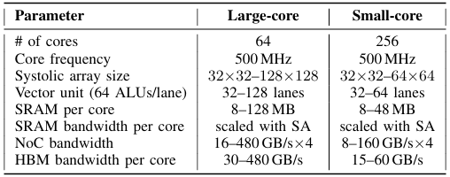

.. _experiment_results:

测试分析
================

在论文中，我们使用 **NPU-SIM** 对众核AI加速器在多场景、多硬件配置下的表现进行了仿真和比较。

仿真配置
-------------

在测试中，我们主要采用两大类的芯片硬件配置：大核模式，即计算核总数相对较少，但每一个计算核具有较强的算力、内存等硬件配置；小核模式，与大核模式相反，包含较多且各硬件指标较低的计算核。具体的参数自由配置空间参见下表。

仿真器验证与仿真耗时
---------------------

我们将 **NPU-SIM** 与真实硬件的运行结果进行比较，验证其仿真结果的精度，并分析了在采用混合仿真模式（Hybrid-mode）下的仿真耗时。具体结果请参阅 :doc:`simulator_validation`。

多场景测试
-------------

我们使用 **NPU-SIM** 模拟了AI众核芯片在多场景下的表现，并给出了对应场景下硬件设计的改进思路。

    - **模型并行与计算核映射** 

      请参阅 :doc:`tp_mapping`

    - **LLM Serving**

      请参阅 :doc:`llm_serving`

附属页面
-------------

.. toctree::
   :maxdepth: 1

   simulator_validation
   tp_mapping
   llm_serving