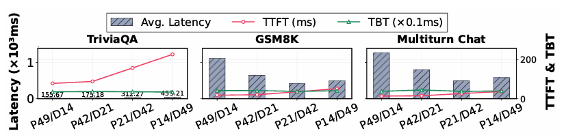
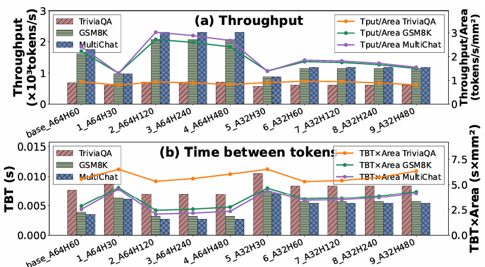
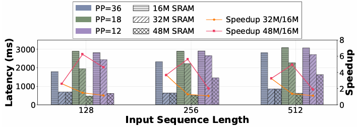
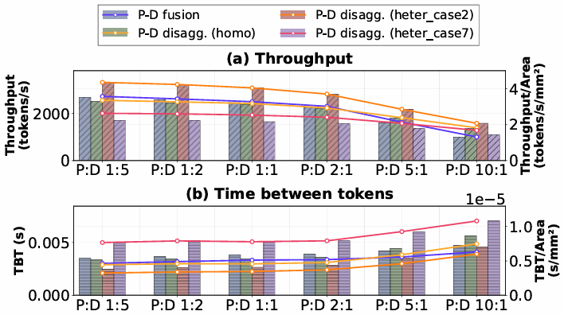

.. _llm_serving:

LLM Serving
================

不同 PSize 下 PD 解耦的核比例：
-------------------------------

我们评估了不同 prefill-decoding（PD）核比例对 LLM 服务性能的影响，使用了 3 种不同的工作负载（TriviaQA、GSM8K、MultiTurnChat）。在本次评估中，我们以 64 核的 Qwen3 4B 为例。

在 prefill 主导型工作负载 中，增加 prefill 核数能够持续降低 TTFT（Time to First Token），而 TBT（Time Between Tokens）对核分配基本不敏感。因此，更大的 prefill 分配能带来显著收益：在 TriviaQA 工作负载下，P42/D21 相比 P14/D49 提供了约 3× 的 TTFT 加速。虽然 P49/D14 获得了最佳 TTFT，但其相对于 P42/D21 的优势很小，因此综合系统效率来看，P42/D21 是更实用的选择。

相反，在 PD 平衡或 decoding 主导型工作负载 中，增加 decoding 核数可以将端到端时延降低最多 2.6 倍，且时延呈现出大致的 U 型趋势。在这种情况下，P21/D42 配置更优，可在仅带来适度 TTFT 损失的前提下将端到端时延最多降低 49%。然而，如果进一步增加 decode 阶段的核数，就会使 prefill 再次成为瓶颈，从而导致整体延迟上升。

总之，最优的核分配比例应根据工作负载特性选择：

- 对 prefill 主导型工作负载，P:D ≈ 2:1 为相对最优；

- 对 PD 平衡或 decoding 主导型工作负载，P:D ≈ 1:2 为最优。

采用极端分配可能会使主导执行阶段发生翻转（从 prefill 变成 decode，或反之），从而最终降低系统性能。

PD 解耦的异构核设计：
------------------------

我们进一步研究了 prefill 与 decode 的异构资源分配，调整以下两个关键架构参数：

- systolic-array 的规模

- HBM 带宽

由于 prefill 是 计算密集型，而 decode 是 内存密集型，我们使 SRAM 带宽与 systolic-array 的计算能力按比例缩放。所有实验均采用 P/D = 2:1 的核心分配比例。芯片面积（包括计算单元、HBM 接口与 SRAM）按 TSMC 7nm 工艺估算。

如图上半部分所示，增加 decoding 核的 HBM 带宽可将吞吐提升最多 1.31×，面积归一化吞吐提升 1.25×（配置 2）。超过该点后（配置 3–4），进一步提升带宽已无额外收益，说明性能瓶颈已从内存转移到计算。

如图下半部分所示，TBT 也呈现类似趋势：增加 decoding 核带宽可持续改善面积归一化 TBT。然而，如果降低计算能力，则会使吞吐与 TBT 相比基线下降 16.7%。这是因为更弱的计算能力降低了 decode 阶段 GEMV 操作的效率，从而增加延迟并整体拉低性能。

不过，当 prefill 主导执行（如 TriviaQA 工作负载）时，吞吐和 TBT 均对 decode 核的异构配置不敏感，因为 decode 只占端到端延迟的一小部分，且 token 数少导致计算利用率低。

PD 融合场景下的硬件优化：
--------------------------

图片展示了在 PD 融合条件下，输入 token 长度、SRAM 容量以及流水线阶段数对端到端时延的影响。当流水线阶段数更少时，每个核心负责处理更多层，从而提高数据并行度。然而，这也会增加每个核心的内存压力，导致更频繁的 SRAM 溢出。因此，在 SRAM 较小（16 MB） 的情况下，采用 36 个流水线阶段 相比于 18 和 12 个阶段分别获得 1.1×–1.61× 的性能提升。

由于 PD 融合设计会提升内存压力，增加 SRAM 容量将显著改善推理性能。例如，将 SRAM 从 16 MB 扩展到 32 MB 会带来性能提升。

PD 解耦与 PD 融合的比较：
---------------------------

图片比较了 PD 解耦与 PD 融合在不同工作负载下的吞吐与 TBT。为了突出异构 PD 解耦的优势，我们从前图中选择了两组异构配置和一组同构基线，与 PD 融合进行对比。

与同构核心上的不同方案相比，在 decoding 主导型工作负载中，PD 融合获得了略高的吞吐（提升 6%）以及更低的 TBT，优于 PD 解耦。

然而，在 prefill 主导型工作负载中，decode 任务会干扰 prefill 任务，从而导致 TTFT 增加。结果是 PD 融合的效果下降，相比 PD 解耦 吞吐下降了 28%。

在多种配置中，结合异构 decode 核的 PD 解耦 在大多数场景下优于 PD 融合，可实现 最高 37% 的吞吐与 TBT 改善。

这些结果表明，PD 解耦天然能够从异构性中获益。当异构资源为真实工作负载进行合理配置时，其能提供明显优于 PD 融合的效率。