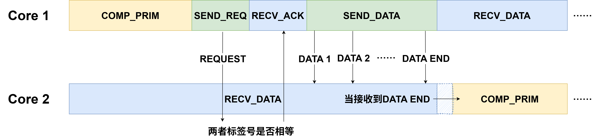

.. _primitive_detail:

原语与工作核通信范式
=====================

原语 (primitive) 是工作核执行任务的最小单位。按照原语的执行逻辑，可将其分为三类：
 
    - 发送原语 (SEND_PRIM)
    - 接收原语 (RECV_PRIM)
    - 计算原语 (COMP_PRIM)

工作核在执行仿真任务时，会严格执行接收数据-执行计算-发送数据的原语执行循环。在 **NPU-SIM** 根据 :doc:`workload_config_detail` 生成原语序列的过程中，会在 :doc:`workload_config_syntax` 中提及的 ``worklist`` 前后各加上对应的 ``SEND_PRIM`` 和 ``RECV_PRIM`` 。

在执行 ``worklist`` 的第一个 ``COMP_PRIM`` 之前， **NPU-SIM** 会先接收从前一个核传来的计算结果。该过程由 ``RECV_PRIM`` 完成。每当接收到一个核的数据，接收计数便增加1。当接收计数等同于该 ``worklist`` 的 ``recv_cnt`` 字段值时，便结束此次 ``RECV_PRIM`` 的执行，进入接下来的 ``COMP_PRIM`` 。

连续的 ``COMP_PRIM`` 在同一工作核上执行时，其中无需插入 ``RECV_PRIM`` 或 ``SEND_PRIM`` ，但需注意后一个 ``COMP_PRIM`` 的输入数据来自前一个 ``COMP_PRIM`` 的输出数据（请参阅 :doc:`memory_detail` ）。

在一个 ``worklist`` 的所有 ``COMP_PRIM`` 执行完成后， **NPU-SIM** 会将计算结果发送给下一个核。该过程由 ``SEND_PRIM`` 完成。发送的地点和次数由 ``cast`` 字段决定。  