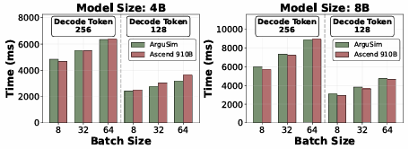

.. _simulator_validation:

仿真器验证与仿真耗时
=======================

在 **NPU-SIM** 中，各个组件均可独立配置不同的仿真模式，主要分为两种：时钟精确级，即在每一个硬件的时钟周期进行一次组件的状态计算和更新。此仿真模式具有较高的仿真精确度，但仿真耗时较高；另一种行为级仿真，则是采用了 **屋檐模型** ，可以跳过重复的周期仿真，将硬件组件的行为用模型近似，在丢失较少仿真精度的情况下，大幅加快仿真速度。

图片对比了 Qwen3 4B 和 Qwen3 8B 模型在 **NPU-SIM** 上运行与在 Ascend-NPU-910B [42] 硬件上使用 vLLM 框架（v0.11.0rc1）运行时的端到端延迟。实验使用了不同的解码序列长度（128 和 256）以及批大小（8 到 64）。在相同的硬件配置和利用率下，ArguSim 的模拟运行时间与真实硬件的执行时间高度一致。尽管真实执行会受到算子设计和软件优化（如调度策略）等因素的影响，ArguSim 仍然能够保持与实际性能趋势一致的对齐表现。