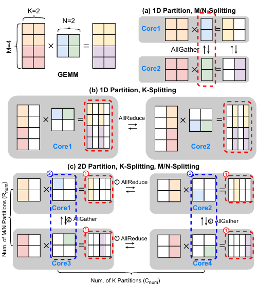
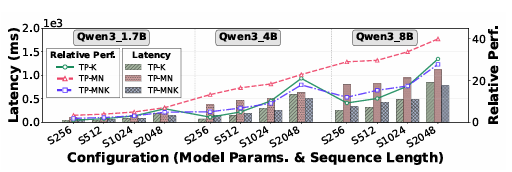
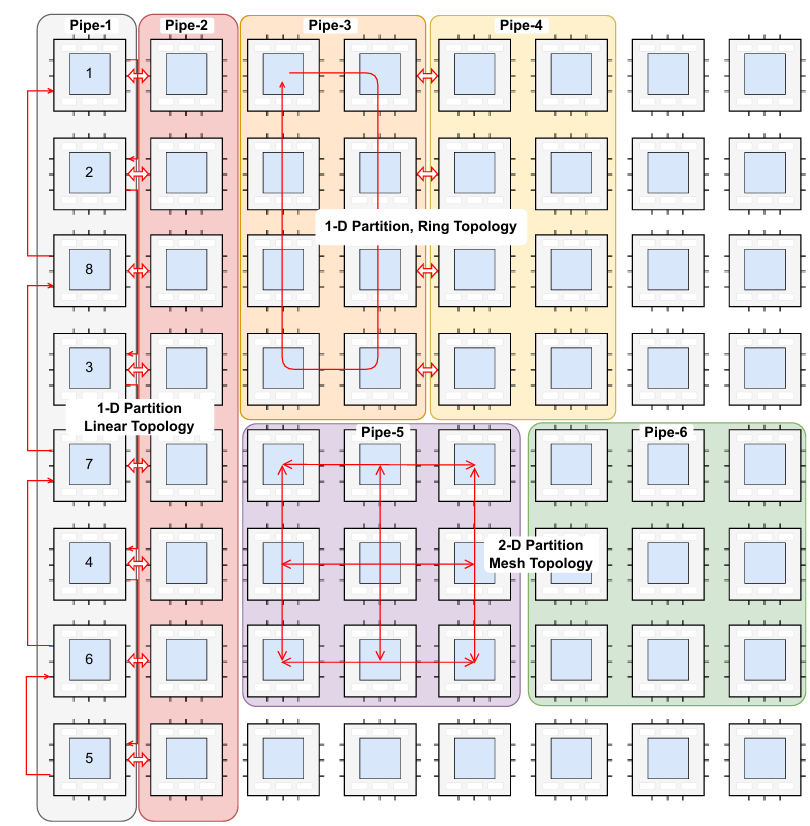

.. _tp_mapping:

模型并行与计算核映射
=======================

本页面将介绍三种优化后的模型并行（TP）策略，以及不同计算核放置策略所带来的模型执行效率提升。

模型并行策略
------------------

下图简单表示了三种优化后的模型并行策略。与传统的TP不同，此处的TP会同时切割输入与权重。

M/N 维度切分
^^^^^^^^^^^^^

将输入沿行方向切割，将权重按列方向切割。计算时保持输入不动，在经过一轮矩阵乘计算后，通过 All Gather 操作轮转所有TP核心上的权重，直至每一块切分后的权重均被所有核接收过至少一次。

在计算过程中，每一个核心最多在本地存放一个权重块。在最终对输出进行 All Gather 操作之前，每一个核心最多仅存放总输出大小的 ``1/TP`` 。

K 维度切分
^^^^^^^^^^^^^

将输入沿列方向切割，将权重按行方向切割。计算时所有数据均保持静止，仅对输出结果进行 All Reduce 操作。

在计算过程中，每一个核心始终需要维护一块大小等同于最终输出的数据块，且最后的输出结果在送往下一步计算前，需要强制进行 All Reduce 操作。

二维 MN/K 切分
^^^^^^^^^^^^^^^^

是前两种TP策略的融合。输入与权重在行和列方向均进行切割。具有较为复杂的通信逻辑。在进行一轮矩阵乘法之后，首先进行 K 方向上的 All Reduce 操作，将每一行核心的输出数据进行整合。随后进行 MN 方向上的 All Gather 操作，将权重搬运到同一列上的其他核心。将一次完整的行 All Reduce 和一轮列 All Gather 流转标记为一次循环。该循环需要重复执行数次，数量等同于权重在列方向上被切分的数量。

模型并行测试
------------------

下图展示了不同规模的模型，在不同TP策略下的端到端执行时延。

当输入序列长度小于模型的隐藏维度时，沿 K 维度的划分具有更好的性能。例如，在 Qwen3_4B 且序列长度为 256 的情况下，K 维度划分的速度比 MN 维度划分快 6.03 倍。然而，一旦序列长度超过隐藏维度，K 维度划分的性能会急剧下降。相比于一维 MN 划分，二维 MN/K 划分表现出更优的性能，平均可获得 1.44 倍的加速。

计算核放置策略
------------------

除了张量划分之外，计算核放置策略也在多核 NPU 的性能中起着关键作用。我们首先将所有 NPU 核心划分为多个流水线（pipeline），其中每条流水线负责处理模型的一层或多层。在每条流水线内部，我们采用张量划分，并结合不同的核心放置策略（如一维或二维、环形或顺序放置）。

放置策略性能对比
------------------

对于 TP=4，linear-interleave 和 linear-seq 的性能相近，而 mesh 和 ring 拓扑分别可获得约 1.17× 的加速。在较小的 TP 规模下，替代拓扑带来的性能提升并不显著。当 TP 扩展至 16 时，优化核心放置策略带来的收益更加明显。相较于 linear-interleave，linear-seq、mesh 和 ring 策略分别可带来最高 1.18×、1.25× 和 1.32× 的加速。虽然 Wafer-LLM 在 Cerebras 上的实验得出 linear-interleave 是最优方案，但这种效果在不同平台上可能有所差异。在我们的实现中，为了确保核间通信无死锁，我们引入了通道锁机制，这反而削弱了交错式通信的性能。相比之下，mesh 和 ring 映射在我们的硬件上表现得更为高效。